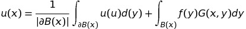
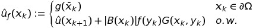

# Monte Carlo Geometry Processing Tutorial Entry
by Wenjie Lu, Yongzhen Huang

### Background and Main Idea
Ideas and Implementation are all based on:
["Monte Carlo Geometry Processing: A Grid-Free Approach to PDE-Based Methods on Volumetric Domains"](https://www.cs.cmu.edu/~kmcrane/Projects/MonteCarloGeometryProcessing/paper.pdf)

#### Walk on Sphere

Recall the Laplace Equation on domain *S*:


and we want it subjects to some boundary condition, on :


The solution **u(x)** is a harmonic function, which means it follows: (1) Mean value property, (2) Kakutani's principle

(1) From mean value property, we know for any **x** in **S**, **u(x)** equals to the mean value of **u** over any ball **B(x)** in domain **S**.


(2) From Kakutani's principle, we know for any **x** in **S**, **u(x)** equals to **E[g(y)]** where **y** is the first boundary point 
reached by a random walk starting at **x**.

Notice that by *symmetry*, a random walk starting at **x** is equal likely to exit at any point on the sphere centered at **x** (despite the routes it takes when walking inside the sphere). Thus, combining (1) and (2) we have:


From here, we can develop the algorithm of Walk On Sphere (WoS). Below is the equation of WoS estimator for the Laplace equation: 


We keep taking point on the sphere until we are very close to the boundary and we can take the boundary value. As the illustration (taken from the paper) below.


If do multiple (N) walks and average over the results, we can get our final Monte Carlo estimatation:


### Key Steps

#### Random Sampling Inside Mesh
First of all, we need to sample points indside the mesh for the WoS Algorithm.

The idea is adpated from [libigl tutorial of fast winding numbers for soups](https://libigl.github.io/tutorial/#fast-winding-number-for-soups-and-clouds).

First, we find the bounding box of the mesh object by taking the colwise maximum and minimum of *V* . 

We generates a list of random query points (*Q*) inside the bounding box , and then we discard all points outside the query model.

 

This can be done using fast winding numbers for triangle soups. As libigl tutorial instructed, it can be done as follows:

```C++
igl::FastWindingNumberBVH fwn_bvh;
Eigen::VectorXf S;
igl::fast_winding_number(V.cast<float>().eval(), F, 2, fwn_bvh);
igl::fast_winding_number(fwn_bvh, 2, Q.cast<float>().eval(), S);
igl::slice_mask(Q, S.array() > 0.5, 1, P);
```
#### Boundary Representations

Now we have starting points for WoS. 

At each iteration, we want to find the largest empty ball **B(x)** around each **x**. This is very intuitive as we only need to determine the distance to the cloest point on boundary. 

```C++
igl::AABB<Eigen::MatrixXd, 3> aabb;
aabb.init(V, F);
// X is initialized to our starting query points P
X = P
while (!end_condition){
    aabb.squared_distance(V, F, X, D, I, C);
    R = D.cwiseSqrt();
    // update X here....
}
```
**D** will be the output contains squared distance for each point in **X** to the closest point stored in **C** (lies on **F** given by **I**). 
**X** will obviously be updated to contain our new points on the sphere that we will use as the center of the ball for next iteration.

#### Point on Sphere Selection

In this section, we describe the idea of updating **X**.
<!-- Given the distance R we just found and in terms of Cartesian coordinates, we increase columns of **X** by:


where **theta** is random sampled betwwen *[0, pi]* and **phi** between *[0, 2pi)*. -->
As our introduction stated, each point on the sphere is equal likely to become the exit point. So we want random sample a point on the surface of our ball.

According to Wolfram's notes on [sphere point picking](https://mathworld.wolfram.com/SpherePointPicking.html), we cannot uniform sample *theta* and *phi* in their corresponding domain of sphere coordinates as it will cause distribution to be denser near the poles of sphere. 

According to the source above, we should sample as follows:

1. Pick *u* to be random variates on *[-1, 1]* and *theta* on *[0, 2pi)*.

<!-- 2. Calculate *theta* and *phi* as: 
 -->

2. Update each column of *X* using Cartesian coordinates:


#### Termination

Repeat the steps of find next largest ball and updating **X** until convergence (close enough to boundary) or maximum number of iterations is reached, we will then obtain our desired **U** (estimated *u(x)* values) according to boundary conditions **B** and cloest points **C**. 

As we discussed in *boundary representation* section, we can use indices in **I** to recover facet of the closest distance. 
Then we use our boundary condition **B** to determine the value.
Below is the idea of this procedure where the function **interpolate** is just interpolating vertex data at the closest point **c** (*C.row(j)*) using [barycentric coordinates](https://en.wikipedia.org/wiki/Barycentric_coordinate_system).

```C++
Eigen::Vector3d phi;
for (int j = 0; j < I.rows(); j++) {
    // interpolate between the three vertices and find value
    int f = I(j);
    interpolate(C.row(j), V.row(F(f, 0)), V.row(F(f, 1)), V.row(F(f, 2)), phi);
    U(j) += phi(0) * B(F(f,0)) + phi(1) * B(F(f,1)) + phi(2) * B(F(f,2));
}
```

This completes 1 walk.

We will do a total of *n_walks* , accumulates the estimated values in **U** for each walk. In the end, average over all walks (**U / n_walks**) to get the final estimation we desired. 

#### Visualization

Below is the visualization of the values stored in **U**. This visualization used around 270k sample points inside the bunny mesh.


Here is a snippet of code of how to use libigl's colormap.

```C++
Eigen::MatrixXd CM;
igl::colormap(igl::COLOR_MAP_TYPE_MAGMA, U, U.minCoeff(), U.maxCoeff(), CM);
```
Continuity illustrated in the visualization proves the correctness of our estimated solution to the Laplace equation.

### Further Exploration

Beyond WoS estimator for Laplace equation as required, we tried to implement WoS estimator for other common equations in geometric processing as decribed in the paper.

#### WoS for Poisson

The Poisson equation is very similar to Laplacian :


where Omega is just domain of interest.

Notice that we introduced another source term . 

According to the paper, we only need to generalize the mean value property and we would obtain the solution value by:



where *G(x, y)* is the harmonic Green’s function on the ball *B(x)*.

Thus, the WoS estimator becomes:



Notice that this means other parts of the WoS stays the same except each time:
1.  a sample point *y_k* is drawn from the largest solid ball *B(x_k)*. (uniformly)
2. add product of volume of the ball, *f(y_k)* and *G(x_k, y_k)* to *u*.

Below is the general idea for one random walk:

```C++
while (!end_condition) {
    // ... same as laplacian
    aabb.squared_distance(V, F, X, D, I, C);
    R = D.cwiseSqrt();

    // sample a point from solid ball B(x) with uniform distribution
    sample_in_spheres(X, R, Y);

    // calculate volume of the ball (4/3 * pi * r^3)
    vols = R.unaryExpr([](double r)->double{ return 4.*PI/3*pow(r, 3); });

    // harmonic green function helper
    Greens_function(X, Y, R, 0, HARMONIC, G);

    // values of f(x_y)
    for(int k = 0; k < Y.rows(); k++)
        Y_res(k) = f(Y.row(k));
    
    // add the product to U
    U = U + vols.cwiseProduct(Y_res).cwiseProduct(G);
    
    // update X same method as laplacian here...
}
// ... same as laplacian, use I, C, F to interpolate and add value to U
```

#### WoS for Biharmonic Equation

According to the paper, we can rewarite the standard Biharmonic Equation to:


Then the WoS estimator of this becomes simple. 
We can use our Poisson estimator described from previous section, and the Laplace estimator to estimate *v(x_k)* at each iteration of the walk.

